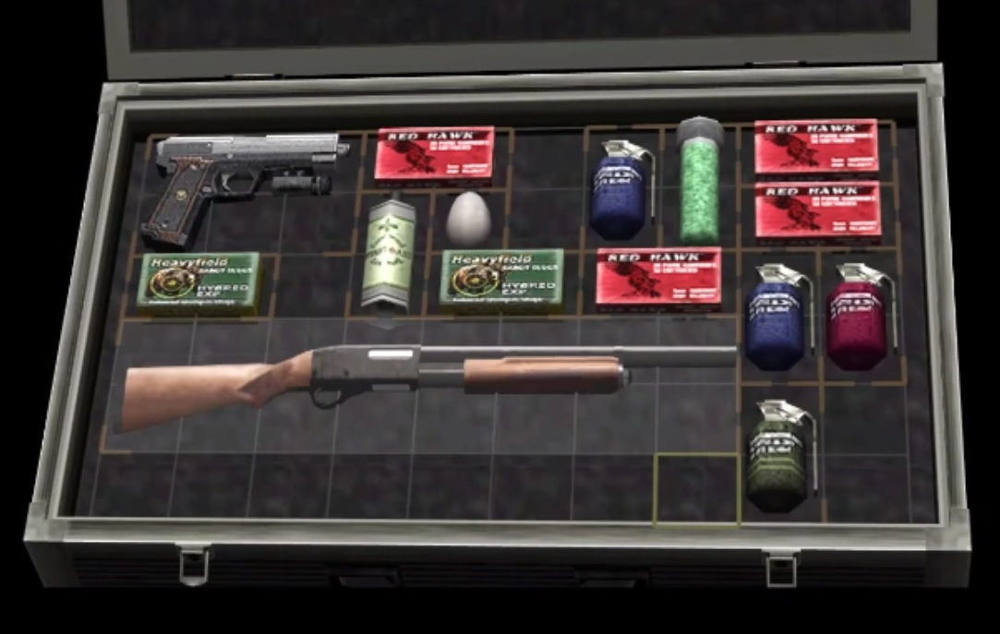

# Knapsack 2D Allocation

Algorithm to solve the 2D rectangle knapsack. Try to fit as many 2D items as possible, while maximizing the value each item provides.

</img>

Picture taken from Resident Evil 4. The player must organize the inventory to fit important items (unlike most games, it doesn't have an *infinite Pocket*).

## How to run

Randomized example:

```bash
cargo run --release -- random --container-square-side 50 --item-count 500 --item-max-square-side 30 --max-benefit 10
```