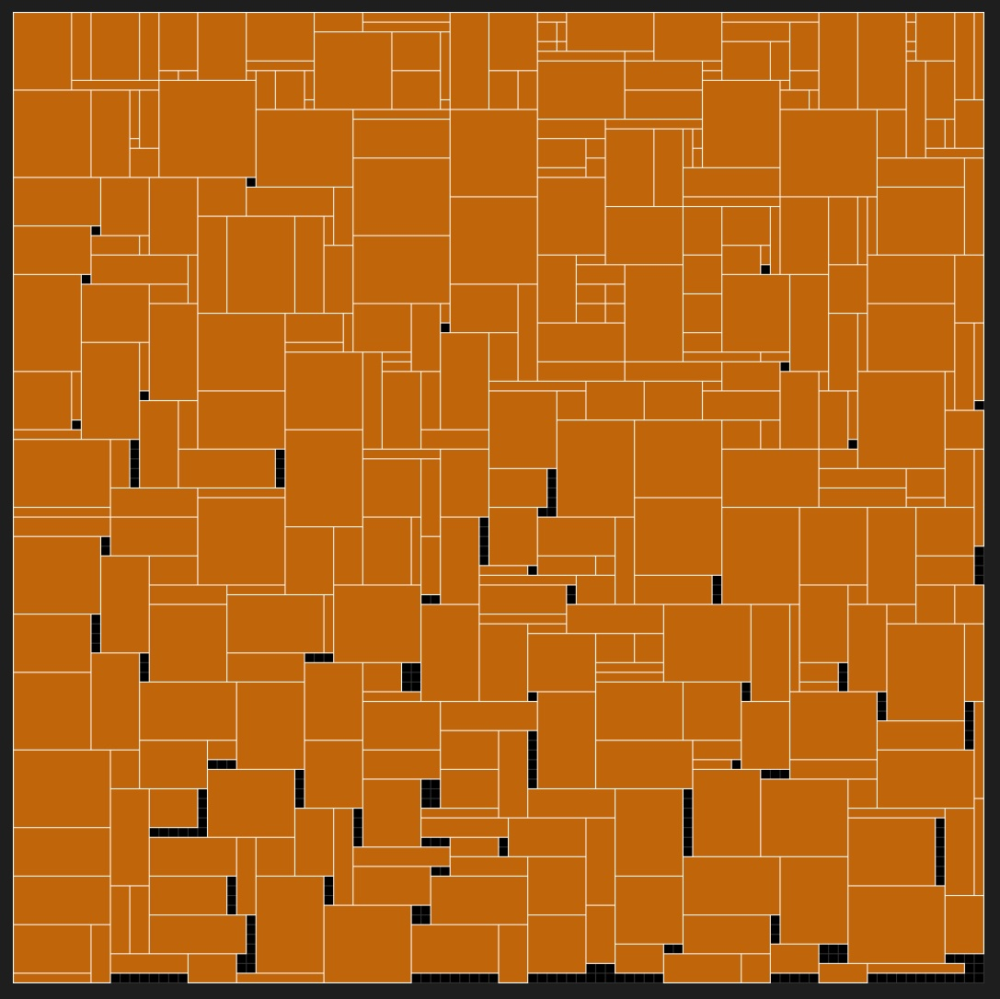
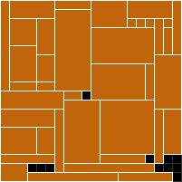

# Knapsack 2D Allocation

Genetic algorithm that solves the 2D rectangle knapsack problem. Try to fit as many rectangular items as possible inside a container, while maximizing the total value the items provide.

Example (visual output):

<p align="center">
  </img>
</p>

<p align="center">
  </img>
</p>

Picture above is taken from Resident Evil 4. The player must organize the inventory to fit important items (unlike most games, it doesn't have an *infinite pocket*). This algorithm follows the same concept.

## Specifications

* Every rectangular item has a `benefit` value assigned to them.
* Tries to maximize the summed benefit of all items. It doesn't try to minimize wasted room. In other words, fit the most important items, avoiding low-value items that use up space.
* The algorithm consists of a mix of the genetic algorithm and ad-hoc heuristics.
* For now, the rectangles are not attempted to be inserted rotated.
* Made with Rust (rustc 1.55.0 and cargo 1.55.0).

## How to run

### Randomized example (easiest)

Generate a random scenario:

```bash
cargo run --release -- random --container-square-side 20 --item-count 160 --item-max-square-side 11 --max-benefit 10
```

In this example, the optimal value goes from 149 to 207 in ~1500 generations. An image is also generated to visualize the result.

<p align="center">
  </img>
</p>

Output log:

```
Gen #0 | Best score: 149 | Gen avg: 114.17 | Current optimal: 149 | Optimal ID: 05566633821962aa9d8f5c4a3eaa5b3d | Wasted room: 4
Gen #1 | Best score: 153 | Gen avg: 112.93 | Current optimal: 153 | Optimal ID: 0f1325681a46b1abfffce280463813aa | Wasted room: 2
...
Gen #63 | Best score: 177 | Gen avg: 89.69 | Current optimal: 183 | Optimal ID: 01d2be0431939ced28fdc937479c5515 | Wasted room: 4
Gen #64 | Best score: 188 | Gen avg: 93.27 | Current optimal: 188 | Optimal ID: 67dd012fdf627c4cd66ff96332e80db5 | Wasted room: 19
...
Gen #244 | Best score: 201 | Gen avg: 97.31 | Current optimal: 201 | Optimal ID: 8a7e5cabda5c1b33bc0db4d0efa3085b | Wasted room: 7
...
Gen #1058 | Best score: 192 | Gen avg: 86.28 | Current optimal: 209 | Optimal ID: 9ae42a1c03f59d2feff45938973c5d36 | Wasted room: 3
...
Gen #1509 | Best score: 207 | Gen avg: 101.49 | Current optimal: 214 | Optimal ID: 9a2e12dd39ef38787ebb47aba54e13b5 | Wasted room: 11

# Press CTRL+C to stop
Stopping...

Gen #1510 | Best score: 207 | Gen avg: 111.95 | Current optimal: 214 | Optimal ID: 9a2e12dd39ef38787ebb47aba54e13b5 | Wasted room: 11
Max score assuming infinite container: 693
Total generations: 1511
Current optimal: 214
Optimal ID: 9a2e12dd39ef38787ebb47aba54e13b5
Wasted room: 11
Generations where local optimums were found: [0, 1, 8, 15, 29, 64, 76, 85, 137, 146, 175, 602, 630, 980, 1343, 1480]
Best solution found: [79, 37, 116, 153, 57, 25, 122, 41, 21, 8, 60, 27, 31, 128, 49, 154, 102, 119, 132, 112, 98, 0, 39, 89, 83, 149, 23, 156, 12, 16, 86, 29, 92, 14, 123, 142, 10, 3, 93, 100, 124, 150, 71, 67, 28, 72, 125, 52, 121, 64, 82, 109, 17, 81, 104, 76, 51, 129, 151, 34, 107, 131, 113, 61, 42, 117, 84, 87, 133, 11, 43, 130, 114, 70, 33, 137, 50, 115, 105, 157, 47, 90, 95, 152, 126, 99, 20, 103, 94, 55, 85, 88, 145, 18, 6, 75, 38, 97, 45, 65, 1, 69, 80, 135, 9, 148, 66, 56, 106, 74, 108, 158, 2, 54, 4, 78, 136, 48, 44, 15, 144, 143, 62, 155, 101, 141, 68, 73, 118, 30, 140, 120, 7, 26, 19, 40, 36, 32, 96, 134, 63, 53, 139, 77, 111, 35, 24, 138, 59, 91, 159, 13, 127, 46, 58, 146, 5, 22, 147, 110]
```

### Read input from file

Create a file named `input_file.txt` with a content like this:

```
12 12
15
3 5 7
7 3 6
6 2 4
7 1 5
10 2 3
6 7 4
2 6 3
1 2 3
8 2 7
5 9 2
10 2 1
5 9 8
8 6 6
4 9 9
2 9 3
```

The first integer is `container width`.

The second integer is `container height`.

The third integer is `number of items`.

The next `number of items` lines contain three integers each, `item width`, `item height` and its `benefit` value.

```bash
cargo run --release -- file --file-input input_file.txt
```

## Issues & To-Do

* Fix many `TODO:` comments in the source code (mostly refactoring).
* Selection, crossover, etc. may be improved in the future to provide better solutions.
